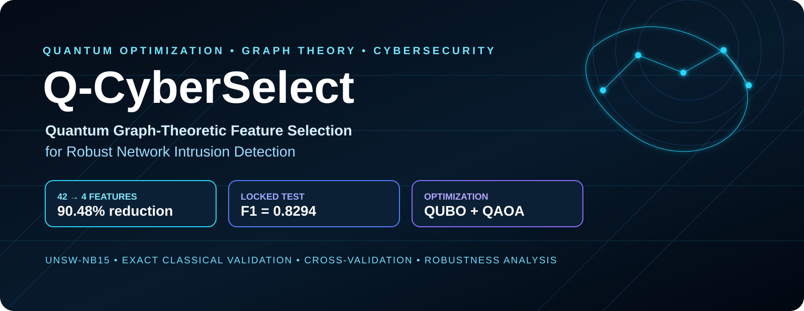
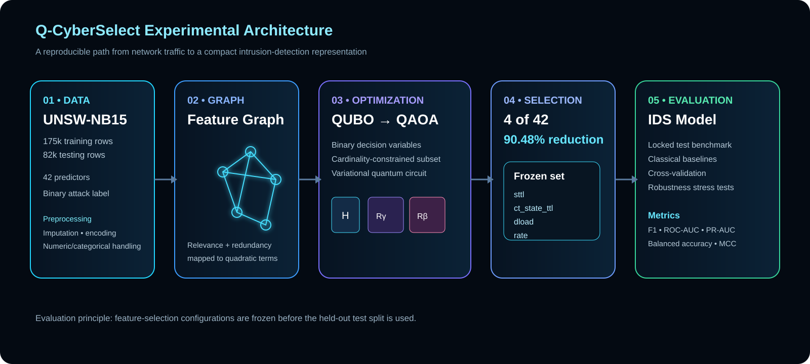
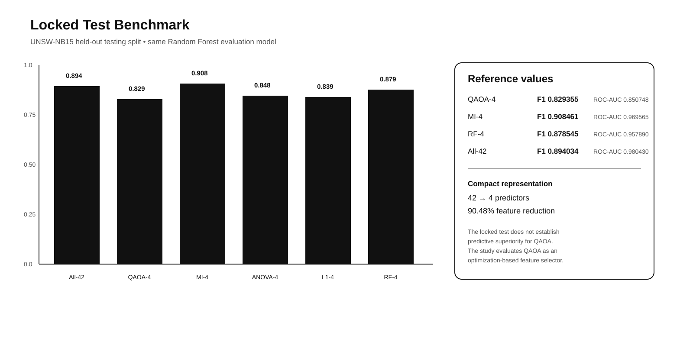

# Q-CyberSelect

<div align="center">

[](https://www.python.org/)
[](https://www.ibm.com/quantum/qiskit)
[](https://isocpp.org/)
[](https://www.rust-lang.org/)
[](https://www.typescriptlang.org/)
[](https://research.unsw.edu.au/projects/unsw-nb15-dataset)

**Quantum graph-theoretic feature selection for network intrusion detection.**

A reproducible research pipeline that formulates feature selection as a binary quadratic optimization problem, solves controlled instances with QAOA, validates solutions against exact classical optimization, and evaluates the selected representation on UNSW-NB15.

</div>

<p align="center"></p>

---

## Overview

Network intrusion-detection datasets can contain dozens of heterogeneous traffic features with substantial redundancy. Q-CyberSelect studies whether a graph-theoretic formulation can compress that feature space into a small, optimization-derived subset without discarding the entire predictive signal.

**Feature relationships → graph construction → QUBO formulation → QAOA optimization → subset selection → classical IDS evaluation → robustness analysis**

The current study uses **UNSW-NB15**, with 42 predictors after excluding the identifier, attack-category field, and binary label.

### Frozen QAOA representation

The feature set used for the locked held-out test evaluation is:

`sttl`, `ct_state_ttl`, `dload`, `rate`

That is **4 selected predictors out of 42**, corresponding to **90.48% dimensionality reduction**.

> The project does **not** claim quantum advantage or predictive superiority. QAOA is evaluated as an optimization mechanism, with exact classical solutions used where tractable and classical feature-selection methods retained as baselines.

## System Architecture

<p align="center"></p>

### Core formulation

Let `x_i ∈ {0,1}` indicate whether feature `i` is selected. A graph-based feature-selection objective is formulated as a binary quadratic program with a fixed-cardinality constraint. Relevance contributes linear terms; feature redundancy contributes pairwise quadratic terms. The resulting QUBO is mapped to QAOA.

## Research Workflow

| Stage | Purpose | Main implementation |
|---|---|---|
| Data preparation | Clean and encode UNSW-NB15 | Python / scikit-learn |
| Feature graph | Estimate feature relationships | Python |
| Optimization | Formulate and solve QUBO instances | Qiskit / QAOA |
| Exact validation | Verify small optimization instances | C++ / Python enumeration |
| Stability | Test seeds and folds | Python |
| Classical comparison | MI, ANOVA, L1, RF selectors | scikit-learn |
| Robustness | Structured and pairwise perturbations | Python |
| Visualization | Present experiment results | TypeScript / frontend |
| Reproducibility | Version scripts and artifacts | Git |

## Locked Test Benchmark

The final held-out UNSW-NB15 test split was evaluated only after the feature-selection configurations had been frozen during development.

<p align="center"></p>

| Method | Features | Reduction | Precision | Recall | F1 | Balanced Acc. | ROC-AUC | PR-AUC | MCC |
|---|---:|---:|---:|---:|---:|---:|---:|---:|---:|
| All-42 | 42 | 0.00% | 0.816646 | 0.987625 | 0.894034 | 0.857974 | 0.980430 | 0.984265 | 0.755034 |
| QAOA-4 | 4 | **90.48%** | 0.772241 | 0.895593 | 0.829355 | 0.785985 | 0.850748 | 0.817297 | 0.592225 |
| MI-4 | 4 | 90.48% | 0.874278 | 0.945425 | 0.908461 | 0.889429 | 0.969565 | 0.969680 | 0.789362 |
| ANOVA-4 | 4 | 90.48% | 0.770608 | 0.943065 | 0.848158 | 0.799559 | 0.889986 | 0.872568 | 0.635692 |
| L1-4 | 4 | 90.48% | 0.754419 | 0.944388 | 0.838782 | 0.783870 | 0.814286 | 0.795371 | 0.610222 |
| RF-4 | 4 | 90.48% | 0.810377 | 0.959234 | 0.878545 | 0.842117 | 0.957890 | 0.963400 | 0.714414 |

## Frozen Feature Sets

| Method | Selected features |
|---|---|
| QAOA-4 | `sttl`, `ct_state_ttl`, `dload`, `rate` |
| MI-4 | `dttl`, `dbytes`, `sttl`, `sbytes` |
| ANOVA-4 | `ct_dst_sport_ltm`, `dload`, `ct_state_ttl`, `sttl` |
| L1-4 | `dload`, `swin`, `proto`, `dttl` |
| RF-4 | `rate`, `sload`, `ct_state_ttl`, `sttl` |

## Robustness Evaluation

Structured perturbations were evaluated at 5%, 10%, and 20% levels on the predefined robustness-feature set where those features were present in the selected representation. At the 10% level:

| Method | Clean F1 | Mean perturbed F1 | Mean degradation | Worst degradation |
|---|---:|---:|---:|---:|
| All-42 | 0.894034 | 0.879632 | 0.014402 | 0.015028 |
| QAOA-4 | 0.829355 | 0.803612 | 0.035042 | 0.070085 |
| MI-4 | 0.908461 | 0.603756 | 0.304705 | 0.475062 |
| ANOVA-4 | 0.848158 | 0.836138 | 0.012020 | 0.023732 |
| L1-4 | 0.838782 | 0.827725 | 0.011057 | 0.022113 |
| RF-4 | 0.878545 | 0.831002 | 0.047542 | 0.081497 |

These perturbation results are protocol-specific and should not be interpreted as a complete model of real adversarial manipulation.

## Pairwise Robustness Analysis

Joint perturbation analysis examined all 28 feature pairs among the eight robustness candidates. The non-additive interaction analysis identified a small number of positive interaction terms, with the strongest interaction involving `sbytes` + `sload`.

A pairwise robustness-aware QUBO was then evaluated over the tested penalty range. The exact optimizer and QAOA returned the same solution at every tested penalty value, with an approximation ratio of 1.0 throughout the sweep. The selected four-feature subset did not change.

The pairwise extension is therefore retained as an **ablation/sensitivity result**, rather than presented as an improved principal model.

## Optimization Validation

Controlled optimization experiments compare QAOA with exact classical enumeration when the search space is small enough to permit exhaustive verification. This validates the mapping from graph formulation to QUBO and separates optimization quality from downstream classifier performance. Matching an exact optimum is reported as an optimization-validation result, not as evidence of quantum speedup.

## Stability and Validation

The experimental program includes seed stability, cross-validation, nested evaluation, selector overlap, exploratory paired statistics, structured perturbation analysis, and joint perturbation analysis. Development-stage analyses are kept separate from the locked held-out test evaluation.

## Classical Baselines

- **Mutual Information (MI):** univariate dependence with the binary intrusion label.
- **ANOVA:** univariate F-statistic ranking.
- **L1 Logistic Regression:** sparse linear feature selection.
- **Random Forest importance:** nonlinear tree-ensemble baseline.
- **All features:** 42-predictor reference model.

## Repository Structure

```text
Q-CyberSelect/
├── cpp/
│   └── baselines/
├── data/
│   └── unsw_nb15/
├── docs/
│   ├── qcyberselect-architecture.svg
│   ├── qcyberselect-hero.svg
│   └── qcyberselect-results.svg
├── frontend/
│   └── src/
├── notebooks/
├── paper/
├── qiskit/
│   └── experiments/
├── results/
├── rust/
│   └── security_pipeline/
├── scripts/
├── PROJECT.md
└── requirements.txt
```

## Reproducibility

### Clone

```bash
git clone https://github.com/Vlastimir0500/Q-CyberSelect.git
cd Q-CyberSelect
```

### Python environment

```powershell
python -m venv .venv
.\.venv\Scripts\Activate.ps1
python -m pip install --upgrade pip
pip install -r requirements.txt
```

### Dataset

Place the pre-split UNSW-NB15 files under:

```text
data/unsw_nb15/
├── UNSW_NB15_training-set.csv
└── UNSW_NB15_testing-set.csv
```

The dataset is not redistributed in this repository.

### Selected experiment commands

```powershell
python qiskit\experiments\build_cyber_feature_graph.py
python qiskit\experiments\qaoa_cv_stability.py
python qiskit\experiments\qaoa_nested_cv.py
python qiskit\experiments\nested_selector_comparison.py
python qiskit\experiments\final_locked_test_benchmark.py
python qiskit\experiments\final_locked_test_robustness.py
```

## Limitations

This repository is a research prototype rather than a production intrusion-detection system. The evidence is limited to the UNSW-NB15 setting and the specified preprocessing, feature graph, optimization, classifier, and perturbation protocols. Exact optimization is feasible only for the controlled small instances used for verification; therefore these experiments do not establish quantum computational advantage. The robustness study uses synthetic structured perturbations and is not a substitute for adaptive adversarial or deployment telemetry validation.

## Reference

Y. Li et al., “Implementing Graph-Theoretic Feature Selection by Quantum Approximate Optimization Algorithm,” *IEEE Transactions on Neural Networks and Learning Systems*, 2024. [DOI: 10.1109/TNNLS.2022.3190042](https://doi.org/10.1109/TNNLS.2022.3190042)

UNSW-NB15: N. Moustafa and J. Slay, University of New South Wales.

## Artifact Status

| Component | Status |
|---|---|
| Literature-grounded formulation | ✅ |
| UNSW-NB15 pipeline | ✅ |
| QAOA feature selection | ✅ |
| Exact optimization validation | ✅ |
| Classical baselines | ✅ |
| Cross-validation / nested validation | ✅ |
| Seed stability | ✅ |
| Statistical analysis | ✅ |
| Structured robustness | ✅ |
| Pairwise robustness ablation | ✅ |
| Locked test benchmark | ✅ |
| Locked test robustness | ✅ |
| Reproducibility artifacts | ✅ |
| Publication-ready manuscript | In progress |

---

<div align="center">

**Q-CyberSelect** — quantum optimization for compact, graph-aware network intrusion detection.

</div>
